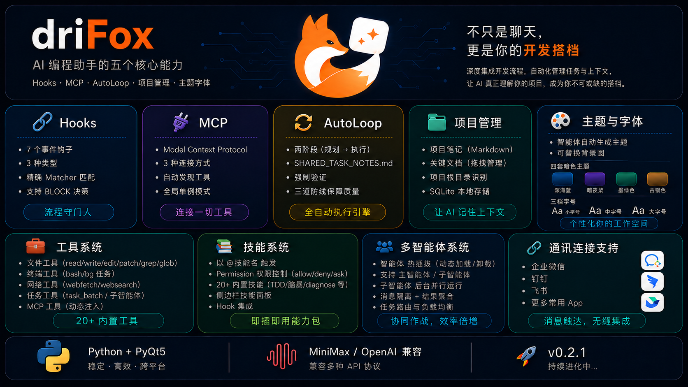
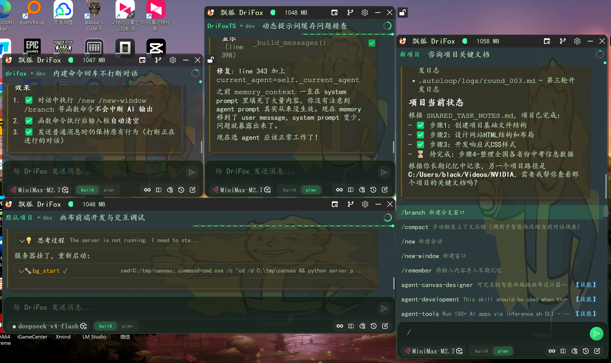
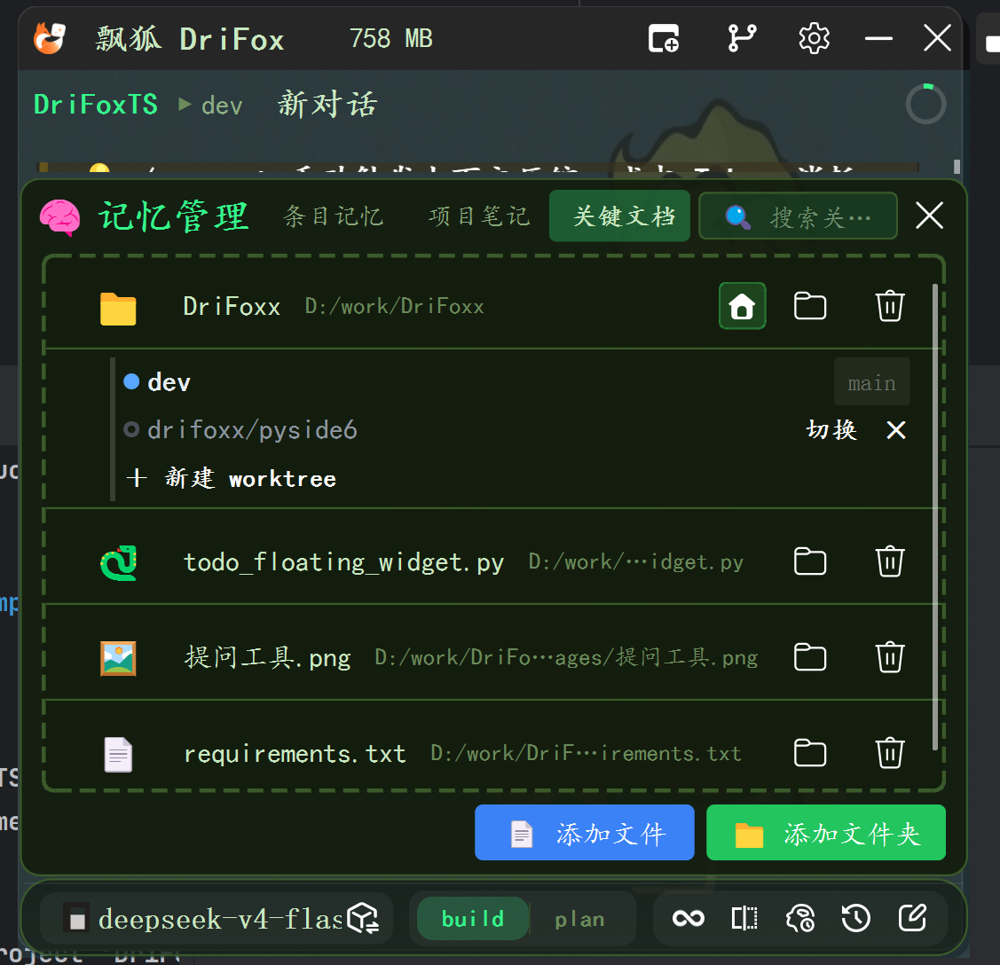
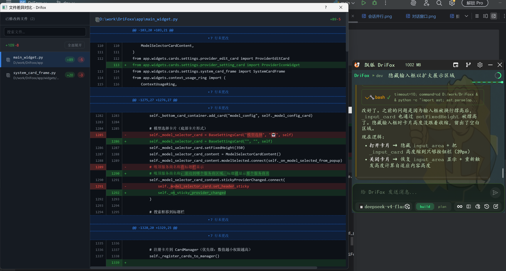
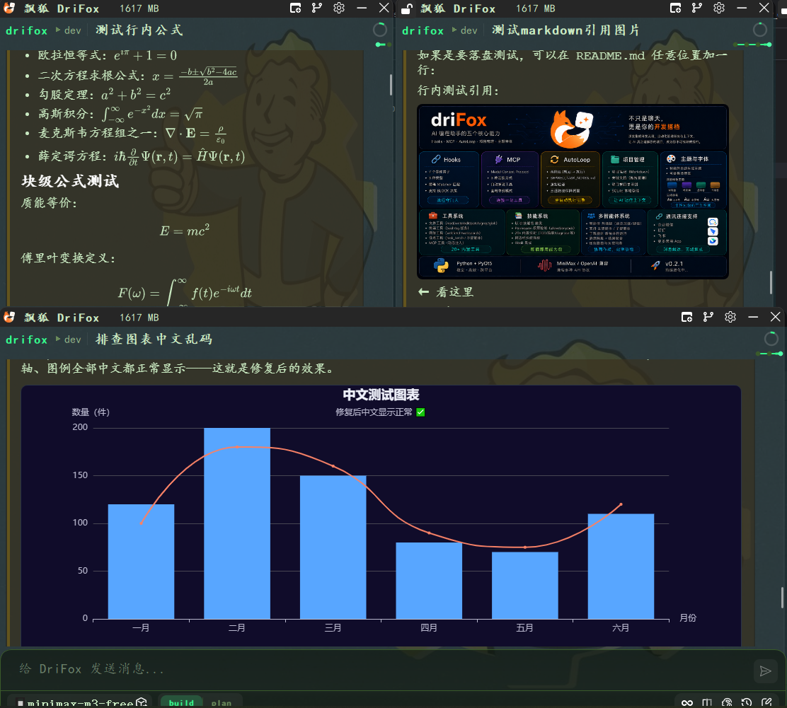
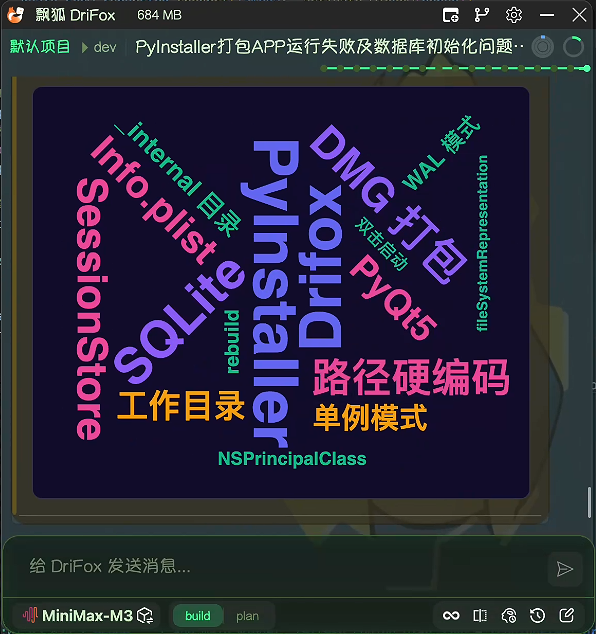
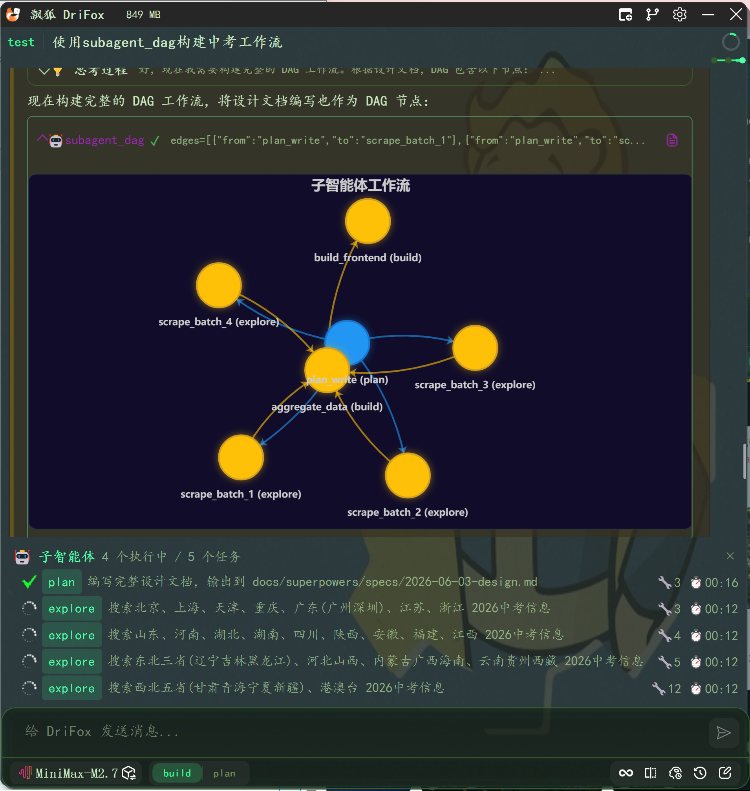
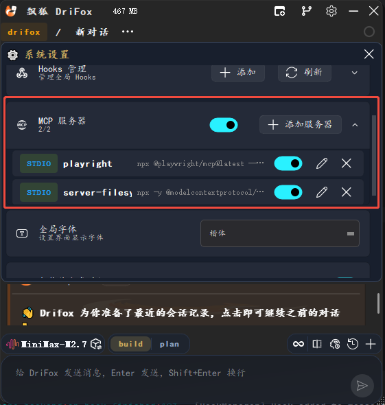

<!-- README.md -->
<p align="center">
  
</p>
<p align="center">
  
</p>

<div align="center">


</div>

<h1 align="center">DriFox 飘狐 — 一个轻量化 AI 桌面对话助手</h1>

---

## 设计理念

**不做大而全的 IDE。** DriFox 只是一个对话框 —— 随时调出，随意提问，随性分支。




### 核心特性

| 特性 | 说明 |
|------|------|
| 🎯 **极简界面** | 仅一个悬浮置顶对话框，随开随用 |
| 🔀 **分支会话** | 问题分叉，多个窗口并行探索不同答案，互不干扰 |
| 🔄 **会话并行** | 多窗口并行处理不同任务，会话管理+历史追踪 |
| 🌲 **Git Worktree** | 直接管理 git worktree，并行开发互不干扰 |
| 🧠 **长记忆** | 越用越懂你的偏好、习惯、禁忌 |
| 📊 **上下文压缩** | 智能 Token 预算控制，长对话自动摘要压缩 |
| 📈 **交互式图表** | 支持 ````echarts` 代码块渲染交互式 ECharts 图表，可缩放、悬停、高亮 |
| ☁️ **词云会话总结** | `/wordcloud` 一键将当前会话总结为交互式 ECharts 词云，可视化提取关键术语 |
| 🖼️ **图片渲染** | Markdown 图片、HTML `` 标签原生渲染，本地图片自动解析为绝对路径 |
| 🔗 **SubAgent DAG** | 有向无环图编排子智能体，自动拓扑排序，并行执行无依赖节点，实时可视化 |
| 🤖 **多智能体并行** | 20+ 子智能体同时执行，独立 LLM 循环+工具环境，实时状态监控 |
| 🧩 **插件系统** | 革命性插件架构，33+ 即装即用插件，颠覆原有系统能力边界 |
| 🔌 **Hook 系统** | 可扩展的事件钩子系统，支持在特定事件触发自定义脚本 |
| 🌐 **MCP 系统** | Model Context Protocol 支持，连接任意 MCP Server 扩展工具能力 |
| 🧩 **Skill 系统** | 支持自动检测系统 Agent、Skill 模块，自带有 20+ 常用技能 |
| 🛠️ **代码工具** | 35+ 工具：读、写、搜索、执行、diff、ECharts 图表等 |
| 🔌 **多模型** | OpenAI / Claude / DeepSeek / MiniMax / 通义 等随时切换 |
| 🛡️ **穿透模式** | 悬浮窗口可穿透点击，不阻断其他应用 |
| 🚀 **自动更新** | 自动检查新版本，随时保持更新 |

---

## 快速开始

### 环境要求
- Python 3.10+
- PySide6 >= 6.8.0

### 安装

```bash
git clone https://github.com/martin98-afk/DriFox-pyside6.git
cd DriFox-pyside6

# 创建虚拟环境
python -m venv .venv
source .venv/bin/activate  # Linux/Mac
.venv\Scripts\activate     # Windows

# 安装依赖
pip install -r requirements.txt
```

### 运行

```bash
python main.py
```

---

## 核心功能详解

### 会话并行

DriFox 支持多窗口并行处理不同任务，让你可以同时探索多个解决方案。



| 功能 | 说明 |
|------|------|
| 分支会话 | 从当前对话分叉，创建独立的新窗口 |
| 会话管理 | 查看最近会话和最活跃会话，方便任务切换 |
| 并行探索 | 多个窗口同时运行，互不干扰 |
| 待办追踪 | 内置待办清单功能，跟踪任务进度 |

---

### Git Worktree 并行开发

DriFox 内置 git worktree 管理，让你能在**不污染主仓库代码**的情况下，自由切换分支进行开发。



| 功能 | 说明 |
|------|------|
| 🌲 **分支树展示** | 自动检测 git 仓库，以树状列表展示所有 worktree 分支 |
| 🔵 **当前分支标识** | 蓝点标识当前活跃分支，一目了然 |
| 🔄 **一键切换** | 点击「切换」立即将工作目录指向对应 worktree |
| ➕ **新建分支** | 直接从 UI 创建新分支 + worktree，自动切换到新分支 |
| 🗑 **安全删除** | 删除 worktree 时自动同步删除对应分支（`git branch -D`）|
| 🏠 **根目录固定** | 原始仓库文件夹始终显示为「根目录」，worktree 切换不影响 |
| 🧠 **AI 感知 worktree** | 提示词自动注入当前 worktree 上下文，AI 清楚知道在哪个分支工作 |

**使用场景：**
- 同时修复多个 bug，每个 bug 一个独立 worktree
- 并行开发多个 feature，互不干扰
- 在主分支稳住的情况下，安全试错新思路

**示例流程：**
```
1. 添加项目文件夹到关键文档，设为工作目录
2. 展开 worktree 树 → 点击「＋ 新建 worktree」
3. 输入分支名 drifox/xxx → 自动创建并切换
4. AI 在 worktree 上编辑代码，不影响主仓库
5. 完成工作后「切换」回主分支，或「✕」删除 worktree
```

---

### 代码差异对比

DriFox 内置可视化的代码差异对比工具，让你可以清晰看到 AI 助手的修改内容。



| 功能 | 说明 |
|------|------|
| 文件列表 | 侧边栏显示所有已修改的文件及其增减行数 |
| 差异高亮 | 新增内容绿色显示，删除内容红色显示 |
| 多文件对比 | 支持同时查看多个文件的修改 |
| 统计摘要 | 显示总体的代码增减统计 |

---

### 上下文压缩

DriFox 内置智能的上下文压缩系统，确保长对话不会超出 Token 限制。


| 机制 | 说明 |
|------|------|
| Token 预算控制 | 实时显示当前上下文占用和预算上限 |
| 智能压缩策略 | 尾保留策略 + 工具调用配对保护 |
| LLM 摘要 | 使用专门的 compaction agent 生成摘要 |
| 可视化显示 | 通过环形图直观显示占用比例 |

**压缩触发条件：**
- Token 占用超过预算阈值（默认 80%）
- 工具迭代中自动增量压缩
- 手动触发压缩（通过指令）

---

### 交互式图表渲染

DriFox 的消息卡片原生支持 **ECharts 交互式图表** 渲染。当 AI 输出 ````echarts` 代码块时，会直接渲染为可交互的图表，支持缩放、悬停、高亮、拖拽等操作。



| 特性 | 说明 |
|------|------|
| 🎨 **ECharts 代码块** | ````echarts {json} ```` 自动渲染为交互式图表 |
| 🔄 **暗色主题** | 内置 ECharts dark 主题，与界面风格统一 |
| 🖱️ **交互操作** | 缩放、拖拽、悬停 Tooltip、邻接高亮 |
| 📊 **图表类型** | 折线图、柱状图、饼图、散点图、关系图(力导向)、雷达图等 |
| 🔗 **DAG 工作流图** | SubAgent DAG 执行时自动生成力导向节点图，实时反映执行状态 |
| 📐 **自适应布局** | ResizeObserver 自动适配窗口大小变化 |
| 🌏 **中文支持** | TextDecoder 解码确保中文标签正常显示 |

**使用方式（AI 自动输出）：**
```markdown
组件配置结果如下：
```echarts
{
  "title": { "text": "性能对比", "left": "center" },
  "xAxis": { "data": ["A", "B", "C"] },
  "yAxis": {},
  "series": [{ "type": "bar", "data": [120, 200, 150] }]
}
```

图表将自动渲染为交互式柱状图/折线图/关系图等。

**应用场景：**
- DAG 工作流可视化：子智能体节点图实时展示执行状态（待执行/运行中/已完成/失败/跳过）
- Token 用量分析：上下文压缩前后的用量对比
- 代码统计分析：文件变更行数、模块覆盖率等
- 数据对比：AI 生成各类统计图表的即时展示

---

### 词云会话总结

DriFox 内置 `/wordcloud` 命令，一键将当前会话内容总结为交互式 ECharts 词云，可视化呈现关键术语与主题焦点。



| 特性 | 说明 |
|------|------|
| 🎯 **一键生成** | 输入 `/wordcloud` 即可将整段对话提炼为词云，无需手动提取 |
| 🎨 **焦点提取** | 支持可选参数指定提取方向，如 `/wordcloud 技术栈`、`/wordcloud 需求点` |
| 📊 **ECharts 词云** | 基于 echarts-wordcloud 渲染，支持缩放、悬停、高亮交互 |
| 🏷️ **品牌配色** | DriFox 五色品牌色系（靛蓝/紫/粉/琥珀/翠绿），按权重自动分配 |
| 🔄 **自动分析** | 自动提取 15-30 个关键术语，按重要程度分配字号和颜色 |
| 🧠 **深度理解** | 结合会话上下文分析，不止统计词频，更理解语义重要性 |

**使用方式：**
```
/wordcloud                  # 自动提取全量关键术语
/wordcloud 技术栈           # 聚焦技术栈相关术语
/wordcloud 问题点           # 聚焦问题与瓶颈
/wordcloud 需求             # 聚焦用户需求与待办
```

**技术细节：**
- 基于 `echarts-wordCloud` 扩展实现，配置通过 ````echarts` 代码块输出
- 所有颜色通过静态 `data[i].textStyle.color` 指定，规避 JSON.parse 无法处理 JS 函数的问题
- 支持 `shape`（circle/polar）、`sizeRange`、`rotationRange`、`gridSize` 等布局参数
- 词云使用 DriFox 品牌色系按权重分层着色

---

### 图片与富媒体显示

DriFox 的消息卡片支持丰富的图片与富媒体渲染能力，让 AI 回复中的图片内容可以直接展示。

| 特性 | 说明 |
|------|------|
| 📷 **Markdown 图片** | 支持 `` 语法，本地图片自动解析为绝对路径 |
| 🖼️ **HTML 图片** | `` 标签原生渲染，支持相对/绝对路径、HTTP/HTTPS/Data URI |
| 🔗 **路径自动解析** | 相对路径自动转为 `file:///` 绝对路径，确保 QWebEngineView 正常加载 |
| 🌐 **远程图片** | 支持 HTTP/HTTPS 网络图片直链加载 |
| 🎨 **背景自定义** | 支持从主题配置加载背景图片（PNG/JPG/WebP） |
| 🧩 **多模态支持** | 上下文压缩智能处理历史图片，避免重复发送 base64 大负载 |
| 📎 **Gateway 图片发送** | 消息网关模式下自动提取 Markdown 图片并发送到目标平台（钉钉/飞书/Discord 等） |

**支持的图片格式：**
- PNG, JPG/JPEG, GIF, WebP, BMP

**工作机制：**
```
AI 回复包含 
    → backend._extract_markdown_images() 提取图片路径
    → _resolve_image_src() 将相对路径转为 file:/// 绝对路径
    → QWebEngineView 加载渲染

Gateway 模式下：
    → 提取本地图片 → adapter.send_image() → 平台原生发送
```

---

### 子智能体 DAG 工作流

DriFox 支持通过 **DAG（有向无环图）** 编排多个子智能体，自动拓扑排序，并行执行无依赖节点，并实时生成可视化工作流图。



| 特性 | 说明 |
|------|------|
| 🔗 **DAG 编排** | 定义 nodes + edges，支持 Pipeline / Fan-out / Hybrid 三种拓扑模式 |
| 🔄 **自动拓扑排序** | 入度为 0 的节点自动并行启动，完成后级联触发下游 |
| 🧠 **结果自动注入** | 下游节点 context 中自动注入所有上游节点的执行结果 |
| ⚡ **并行执行** | 无依赖关系的节点同时运行，互不干扰 |
| 🎯 **智能体自动匹配** | 按任务类型描述自动选择合适的子智能体 |
| 📊 **实时可视化** | ECharts 力导向图实时展示节点状态（颜色编码） |
| 🛡️ **环检测** | 自动检测环路，防止死循环 |
| ❌ **级联失败** | 上游失败 → 下游自动 skip，不浪费算力 |
| 🔍 **结果追溯** | 每个节点独立可查询，通过 subagent_status 获取详细日志 |

**状态颜色编码：**

| 状态 | 颜色 | 说明 |
|------|------|------|
| ⏳ **pending** | 黄色 | 等待执行 |
| 🔵 **running** | 蓝色 | 正在执行中 |
| ✅ **completed** | 绿色 | 执行成功完成 |
| ❌ **failed** | 红色 | 执行失败 |
| ⏭️ **skipped** | 灰色 | 因上游失败自动跳过 |

**支持的 DAG 拓扑模式：**

| 模式 | 说明 | 适用场景 |
|------|------|----------|
| **Pipeline** | 严格的串行链 | A → B → C，依赖关系明确 |
| **Fan-out** | 先并行再汇聚 | 多路探索 → 汇总分析 |
| **Hybrid** | 分支 + 汇合点混合 | 复杂任务：分析 → 多路实现 → 审查汇总 |

**执行流程：**
```
1. AI 分析任务 → 标记依赖 → 设计拓扑
2. 调用 subagent_dag(nodes=[...], edges=[...])
3. SubAgentManager 验证 DAG（节点存在性 + 环检测）
4. 入度为 0 的节点并行启动（独立 QThread + LLM 调用 + 工具环境）
5. 节点完成后自动更新 ECharts 节点图状态
6. 级联检查下游 → 入度为 0 时启动
7. 全部完成 → 清理状态 → 汇总结果
```

**示例：**
```python
# AI 自动生成 DAG 调用
subagent_dag(
    nodes=[
        {"id": "plan", "agent": "plan", "description": "分析需求制定方案"},
        {"id": "explore_1", "agent": "explore", "description": "研究模块A"},
        {"id": "explore_2", "agent": "explore", "description": "研究模块B"},
        {"id": "build", "agent": "build", "description": "编码实现"},
        {"id": "review", "agent": "code-reviewer", "description": "代码审查"},
    ],
    edges=[
        {"from": "plan", "to": "explore_1"},
        {"from": "plan", "to": "explore_2"},
        {"from": "explore_1", "to": "build"},
        {"from": "explore_2", "to": "build"},
        {"from": "build", "to": "review"},
    ]
)
```

---

### Hook 系统

DriFox 支持通过可视化界面配置和管理 Hook 事件钩子。


#### 支持的事件类型

| 事件 | 触发时机 |
|------|----------|
| **SessionStart** | 新会话启动时 |
| **PreUserMessage** | 用户消息发送前 |
| **PostUserMessage** | 用户消息发送后 |
| **PreAssistantMessage** | AI 助手回复前 |
| **PreToolUse** | 工具执行前（可 BLOCK） |
| **PostToolUse** | 工具执行后 |

#### Hook 配置

- 通过设置界面可视化配置 Hook
- 支持启用/禁用单个 Hook
- 支持自定义工作目录和环境变量
- 支持输出结构化显示
- 支持三种类型：**command** / **http** / **python function**

#### 决策控制

Hook 可通过以下方式控制流程：
- Exit code 2 → BLOCK（跳过工具执行）
- JSON 输出 `{"decision": "block"}` → BLOCK
- JSON 输出 `{"decision": "continue"}` → 继续

---

### MCP 系统

DriFox 支持通过 [Model Context Protocol (MCP)](https://modelcontextprotocol.github.io/) 扩展 AI 工具能力，可连接任意 MCP Server 并直接调用其提供的工具。



#### 支持的服务器类型

| 类型 | 说明 |
|------|------|
| **stdio** | 通过标准输入/输出通信，适用于本地命令行工具（如 `npx @modelcontextprotocol/server-filesystem`）|
| **sse** | 通过 Server-Sent Events 通信，适用于 HTTP 服务器 |
| **http** | 通过 Streamable HTTP 通信，适用于现代 MCP HTTP 端点 |

#### MCP 工具使用

- 配置好 MCP Server 后，工具会自动出现在 AI 的可用工具列表中
- MCP 工具名格式：`mcp__{server_name}__{tool_name}`，如 `mcp__github__create_issue`
- 连接/断开服务器无需重启软件，配置变更即时生效
- 多窗口共享同一个 MCP 连接池，高效利用系统资源

#### 常用 MCP Server 推荐

```bash
# 文件系统
npx -y @modelcontextprotocol/server-filesystem /path/to/directory

# GitHub API
npx -y @modelcontextprotocol/server-github

# Playwright 浏览器自动化
npx -y @modelcontextprotocol/server-playwright

# PostgreSQL 数据库
npx -y @modelcontextprotocol/server-postgres postgresql://localhost/mydb

# Google Maps
npx -y @modelcontextprotocol/server-google-maps
```

#### 权限控制

所有 MCP 工具默认需要用户确认（`ask`），可在设置中调整权限规则。

---

### 插件系统

DriFox 的 **插件系统（Plugin System）** 是其能力扩展的核心基石，从根本上颠覆了原生系统的功能边界。插件架构将**命令、智能体、技能、主题、Hooks、MCP 配置**等所有扩展能力统一纳入插件化治理，实现"即装即用、热插拔、可组合"。

#### 架构总览

```
项目根目录/
├── plugins/
│   └── system/              # 系统内置插件（打包在 exe 中）
│       ├── .drifox-plugin/
│       │   └── plugin.json   # 插件清单（声明组件）
│       ├── commands/         # 系统命令（/explore, /plan, /dag 等）
│       ├── agents/           # 系统智能体（explore, build, review 等）
│       ├── skills/           # 系统技能（brainstorming, tdd 等）
│       ├── themes/           # 系统主题
│       ├── hooks/            # 系统 Hooks
│       └── .mcp.json         # 默认 MCP 配置
│
├── .drifox/
│   └── plugins/              # 用户安装的第三方插件（33+ 个）
│       ├── superclaude/      # 18 个专业子智能体（架构师/审计师等）
│       ├── feature-dev/      # 功能开发全流程（code-architect/explorer）
│       ├── code-review/      # 代码审查增强
│       ├── code-simplifier/  # 代码简化重构
│       ├── hookify/          # 行为钩子系统
│       ├── pyright-lsp/      # Python 语言服务器
│       ├── rust-analyzer-lsp/# Rust 语言服务器
│       ├── github/           # GitHub MCP 集成
│       ├── playwright/       # 浏览器自动化 MCP
│       ├── security-guidance/# 安全审计指导
│       ├── user-custom/      # 用户自定义配置（MCP/Hooks）
│       └── ...               # 33+ 插件持续增长
```

#### 核心机制

| 机制 | 说明 |
|------|------|
| 🧩 **统一插件化** | 命令、Agent、Skill、主题、Hook、MCP 全部以插件形式管理，系统不与任何组件紧耦合 |
| 📦 **双源发现** | 扫描 `plugins/system/`（系统）和 `.drifox/plugins/`（用户），用户插件自动覆盖同名系统插件 |
| 🔖 **清单驱动** | 每个插件含 `.drifox-plugin/plugin.json`，声明含有的组件类型 |
| 🔄 **热插拔** | 启用/禁用插件无需重启，运行时 `rescan()` 检测新增/移除，各子系统自动重载 |
| 🏷️ **命名空间隔离** | 用户插件添加命名空间前缀（如 `/my-plugin:command`），避免冲突 |
| 🧬 **兼容 Claude** | 兼容 `.claude-plugin/plugin.json` 格式，无缝迁移现有生态插件 |
| ⚙️ **MCP 配置合并** | 多个插件各自的 `.mcp.json` 自动合并去重，同名策略高阶覆盖低阶 |

#### 插件生命周期

```
发现 (scan_plugins) → 注册 (PluginInfo) → 启用 (enable_plugin)
    → 各子系统查询 (get_plugin_dirs) → 运行时重扫 (rescan) → 禁用 (disable_plugin)
```

- **初始化时**：PluginManager 扫描系统 + 用户插件目录，构建插件映射表
- **运行时重扫**：检测新增/移除的插件目录，`rescan()` 返回 change set
- **热重载**：启用/禁用插件立即反映到命令列表、Agent 列表、MCP 配置等

#### 插件能做什么

| 组件 | 说明 | 示例 |
|------|------|------|
| **commands/** | 自定义命令，`/xxx` 形式触发 | `/explore`、`/plan`、`/dag`、`/wordcloud` |
| **agents/** | 新增子智能体角色 | `architecture-critic`、`security-auditor`、`deep-research` |
| **skills/** | 安装技能模块 | `@brainstorming`、`@tdd`、`@diagnose` |
| **themes/** | 主题样式文件 | 深色主题、自定义配色 |
| **hooks/** | 事件钩子脚本 | SessionStart、PreToolUse 等 6 种事件 |
| **.mcp.json** | MCP 服务器配置 | GitHub、Playwright、数据库等 |

#### 已安装插件精选（33+）

**语言服务器类：**
| 插件 | 说明 |
|------|------|
| pyright-lsp | Python 类型检查与代码分析 |
| rust-analyzer-lsp | Rust 语言服务器 |
| jdtls-lsp | Java 语言服务器 |
| typescript-lsp | TypeScript/JavaScript 语言服务器 |
| gopls-lsp | Go 语言服务器 |
| csharp-lsp | C# 语言服务器 |
| kotlin-lsp | Kotlin 语言服务器 |
| ruby-lsp | Ruby 语言服务器 |
| php-lsp | PHP 语言服务器 |
| lua-lsp | Lua 语言服务器 |
| clangd-lsp | C/C++ 语言服务器 |

**开发增强类：**
| 插件 | 说明 |
|------|------|
| **superclaude** | 18 个专业子智能体：backend-architect、frontend-architect、deep-research-agent、security-engineer、performance-engineer、quality-engineer、refactoring-expert、pm-agent、root-cause-analyst、devops-architect、system-architect、learning-guide、python-expert、security-auditor、technical-writer、socratic-mentor、requirements-analyst、code-reviewer |
| **feature-dev** | 功能开发全流程：code-architect（架构设计）、code-explorer（代码探索）、code-reviewer（审查）|
| **code-review** | 代码审查增强（commands + hooks） |
| **code-simplifier** | 专注于代码简化和重构的智能体 |
| **code-modernization** | 代码现代化：architecture-critic、legacy-analyst、security-auditor、business-rules-extractor、test-engineer |
| **hookify** | 可视化行为钩子编辑器，分析对话→自动生成 Hook |
| **security-guidance** | 安全编码指导与 OWASP 检查 |
| **commit-commands** | Git 提交辅助命令 |
| **mcp-server-dev** | MCP 服务器开发工具包 |
| **mcp-tunnels** | MCP 隧道连接管理 |
| **plugin-dev** | 插件开发脚手架（agents + commands + skills）|
| **skill-creator** | 技能创建向导 |
| **session-report** | 会话报告生成技能 |
| **ralph-loop** | 自定义执行循环模式 |
| **playground/sandbox** | 实验性功能沙盒 |

**MCP 集成类：**
| 插件 | 说明 |
|------|------|
| github | GitHub API MCP 服务器 |
| playwright | 浏览器自动化 MCP 服务器 |

#### 工作原理

```
用户安装插件 → PluginManager 扫描发现
    → 解析 plugin.json → 注册组件路径
    → 各子系统按需查询：
        ├── CommandManager.get_command_files() → 加载所有插件的命令
        ├── AgentManager 扫描 agents/ → 注册新的子智能体
        ├── SkillManager 扫描 skills/ → 技能可被 @技能名 触发
        ├── ThemeManager 扫描 themes/ → 新增主题选项
        ├── HookManager 加载 hooks/ → 事件触发
        └── MCP 配置合并 → 所有 .mcp.json 合并为一个列表
```

**命名空间规则：**
```
系统插件命令：  /explore, /plan, /dag         （短名称）
用户插件命令：  /my-plugin:custom-command      （命名空间前缀，避免冲突）
用户智能体：    自动追加命名空间到描述中
用户技能：      通过 @技能名 触发，同名时用户覆盖系统
```

**插件与技能的关系：**
- **插件（Plugin）** 是容器，可以包含命令、Agent、技能、主题、Hooks、MCP 配置
- **技能（Skill）** 是插件的一种组件类型，存放在 `skills/` 目录下

---

### 浮动窗口特性

| 特性 | 说明 |
|------|------|
| 穿透模式 | 鼠标可穿透窗口到达下层应用 |
| 透明度调节 | 0-100% 可调 |
| 锁定按钮 | 在穿透模式下仍可交互的独立控制点 |

---

## 核心架构

```
┌─────────────────────────────────────────────────────────────────┐
│                       DriFox 架构                               │
├─────────────────────────────────────────────────────────────────┤
│  UI 层                                                          │
│  ├── ToolPopupDialog – 浮动窗口容器（穿透/透明）                │
│  ├── OpenAIChatToolWindow – 主聊天窗口                          │
│  ├── MessageCard – 消息卡片渲染（Markdown/代码高亮/ECharts/图片)│
│  ├── DiffViewer (QWebEngineView) – 代码差异对比视图             │
│  ├── SegmentWidget – 分段任务窗口                               │
│  ├── SubAgentCompactFloatingWidget – 子智能体运行状态悬浮框     │
│  ├── HookSettingCard – Hook 设置卡片                            │
│  ├── MCPListSettingCard – MCP Server 配置卡片                   │
│  ├── ContextUsageRing – 上下文用量环形图                        │
│  ├── CodingPlanRing – 套餐用量三层环图                          │
│  └── BottomInputArea – 底部输入区                              │
├─────────────────────────────────────────────────────────────────┤
│  渲染层                                                         │
│  ├── render_helpers – 工具块 HTML 渲染（参数表格/diff/ECharts）│
│  ├── message_content – 消息内容格式化与 echarts 字段序列化      │
│  ├── diff_viewer – Git 风格差异 HTML 生成器                     │
│  ├── _resolve_image_src – 图片相对路径→绝对路径自动解析         │
│  └── ECharts 5 (CDN) – 交互式图表（DAG节点图/统计图）          │
├─────────────────────────────────────────────────────────────────┤
│  引擎层                                                         │
│  ├── ChatEngine – 对话上下文组装与 LLM 调用                     │
│  ├── ContextBuilder – 消息规范化与系统提示注入                 │
│  ├── ToolExecutor – 工具执行（文件/终端/网络/子智能体/DAG）    │
│  ├── AgentManager – Agent 定义加载与切换（含插件扩展）         │
│  ├── PluginManager（单例）– 插件发现/热插拔/资源查询           │
│  │   ├── scan_plugins – 系统+用户双源扫描                     │
│  │   ├── rescan – 运行时热重载，检测新增/移除                   │
│  │   ├── get_plugin_dirs – 向各子系统提供组件路径               │
│  │   ├── get_mcp_servers – 多插件 MCP 配置合并                 │
│  │   └── enable/disable – 插件启用/禁用持久化                  │
│  ├── HistoryCompactor – 上下文压缩（含图片多模态处理）         │
│  ├── SubAgentManager – 子智能体 DAG 编排与执行引擎              │
│  │   ├── execute_dag – DAG 验证+拓扑排序+并行启动              │
│  │   ├── SubAgentExecutor – 单子智能体 QThread 执行器          │
│  │   └── _build_dag_echarts_json – DAG 节点图生成              │
│  ├── HookManager – Hook 生命周期管理与事件触发                  │
│  └── Gateway – 多平台消息网关（含图片发送）                    │
├─────────────────────────────────────────────────────────────────┤
│  存储层                                                         │
│  ├── SessionManager – 会话管理                                 │
│  ├── MemoryManager – 长期记忆（SQLite）                        │
│  ├── HistoryManager – 归档与检索                               │
│  ├── SubAgentLogRepository – 子智能体日志持久化                │
│  └── SessionStore – SQLite 持久化                              │
└─────────────────────────────────────────────────────────────────┘
```

---

## Agent 系统

采用 **Primary / Subagent / Hidden** 三层设计，通过 Markdown + YAML frontmatter 定义。Agent 可通过 **DAG 工作流** 编排，自动拓扑排序、并行执行、结果注入。

| 类型 | Agent | 说明 |
|------|-------|------|
| **Primary** | `plan` | 任务规划与分解（只读）|
| **Primary** | `build` | 代码构建（全工具权限）|
| **Primary** | `code-reviewer` | 代码审查 |
| **Subagent** | `explore` | 代码库探索 |
| **Subagent** | `general` | 通用任务并行执行 |
| **Subagent** | `architecture-critic` | 架构评审（反向验证） |
| **Subagent** | `security-auditor` | 安全审计（OWASP） |
| **Subagent** | `test-engineer` | 测试用例编写 |
| **Subagent** | `legacy-analyst` | 遗留代码分析 |
| **Subagent** | `business-rules-extractor` | 业务规则提取 |
| **Subagent** | `root-cause-analyst` | 根因分析 |
| **Subagent** | `code-simplifier` | 代码简化重构 |
| **Subagent** | `deep-research` | 深度研究分析 |
| **Subagent** | `backend-architect` | 后端架构设计 |
| **Subagent** | `frontend-architect` | 前端架构设计 |
| **Hidden** | `summary` | 信息总结 |
| **Hidden** | `compaction` | 上下文压缩 |
| **Hidden** | `title` | 会话标题生成 |
| **Hidden** | `auto_loop` | 自动循环模式 |

### Agent 定义示例

```markdown
---
name: build
mode: all
temperature: 0.3
permission:
  "*": allow
---

# Role
你是一个专业的 coding builder...
```

---

## 工具系统（35+）

### 内置工具

| 类别 | 工具 |
|------|------|
| **文件** | read, write, edit, multi_edit, patch, grep, glob, list, diff |
| **执行** | bash, bg_start, bg_stop, bg_logs, bg_list |
| **网络** | webfetch, websearch |
| **代码** | get_diagnostics |
| **记忆** | memory_save, memory_search, memory_list |
| **任务** | todowrite, todoread, task, task_batch, task_wait, skill, list_skills |
| **子智能体** | subagent_para（并行分发）, subagent_dag（DAG 工作流）, subagent_status（状态查询）|
| **MCP** | `mcp__server__tool` — 连接 MCP Server 后自动出现 |
| **其他** | scan_repo, stage_files, question, read_project_note, edit_project_note |

---

## Skills 系统

Skills 是扩展 AI 能力的可安装模块，每个 Skill 包含 `SKILL.md` 定义工作流程。Skill 可作为**插件组件**，由插件系统的 `skills/` 目录提供；也支持通过 `.drifox/skills/<name>/` 直接安装。

### 内置 Skills (20+)

| Skill | 功能 | 触发条件 |
|-------|------|----------|
| brainstorming | 头脑风暴与创意发散 | 用户表达创意需求 |
| caveman | 极简压缩沟通（减少75% token）| 用户说 "caveman mode" |
| diagnose | 硬 bug 与性能回归诊断 | 用户报告 bug |
| find-skills | 发现和安装新技能 | 用户询问如何做某事 |
| tdd | 测试驱动开发（红-绿-重构）| 用户要求 TDD 开发 |
| to-issues | 将计划转换为 Issue 清单 | 用户需要拆解任务 |
| write-a-skill | 创建新的 Skill | 用户要创建技能 |
| writing-plans | 计划文档编写 | 用户有需求要规划 |
| git-commit | 智能 git 提交 | 用户要求提交代码 |
| grill-me | 挑战性提问评审 | 用户需要挑战性反馈 |
| grill-with-docs | 基于文档的问答评审 | 用户提供文档审查 |
| triage | 任务分类与优先级排序 | 用户需要任务分诊 |
| improve-codebase-architecture | 代码架构改进 | 用户要重构代码 |
| setup-matt-pocock-skills | Matt Pocock 学习路径 | 用户想学习技能 |
| minimax-image-understanding | MiniMax 图片理解 | 用户发送截图 |
| zoom-out | 宏观视角分析 | 用户需要全局视野 |
| to-prd | 需求文档生成 | 用户需要 PRD |
| skill-creator | Skill 创建指南 | 用户要创建技能 |

### Skill 标准结构

```
skill-name/
├── SKILL.md              # 主文件 (必需)
├── references/           # 参考文档 (可选)
├── scripts/               # 工具脚本 (可选)
└── assets/               # 资源文件 (可选)
```

### 自定义 Skill

在 `.drifox/skills/<name>/` 或安装在插件 `skills/` 目录下添加 Skill，使用 `/技能名` 触发。

---

## 记忆系统

自动学习用户偏好，支持：
- **置信度评分**：每条记忆有 0-1 的置信度
- **冲突管理**：相同组的新记忆压制旧记忆
- **分类组织**：偏好/约束/习惯分类存储

### SQLite 数据库

数据库文件：`.drifox/sessions.db`

| 表名 | 用途 | 主要字段 |
|------|------|----------|
| sessions | 会话历史 | session_id, title, messages, compaction_state, created_at |
| memories | 长期记忆 | memory_id, content, confidence, category, source |
| file_operations | 文件操作撤销 | id, tool_name, file_path, backup_path |

### 数据目录

```
.drifox/
├── sessions.db            # SQLite 数据库
├── skills/                # 用户自定义 skills
├── issues/               # Issue 追踪
├── tasks/                # 定时任务
├── backups/             # 增量备份
└── archived/            # 会话归档
```

---

## Roadmap

以下功能正在规划中：

| 功能 | 说明 | 状态 |
|------|------|------|
| 🧩 **多窗口粘合** | 窗口组管理，多个窗口粘合后可一起拖动一起管理 | ✅ 已实现 |
| 🌲 **Git Worktree** | 直接管理 git worktree，并行开发互不干扰 | ✅ 已实现 |
| 📈 **交互式图表渲染** | 支持 ````echarts` 代码块渲染交互式 ECharts 图表 | ✅ 已实现 |
| 🖼️ **图片与富媒体显示** | Markdown/HTML 图片原生渲染，本地图片路径自动解析 | ✅ 已实现 |
| 🔗 **SubAgent DAG 工作流** | 有向无环图编排子智能体，拓扑排序+并行执行+实时可视化 | ✅ 已实现 |
| 🤖 **多智能体并行** | 20+ 子智能体并行执行，独立 LLM 循环+工具环境 | ✅ 已实现 |
| 📊 **上下文用量环形图** | 实时显示 Token 占用比例和缓存命中率的环形可视化 | ✅ 已实现 |

---

### Issue 格式

在 `.drifox/issues/` 创建 `0001_问题名称.md`：

```markdown
# Issue 标题

## 严重程度: 高/中/低
## 状态: 待修复/进行中/已解决

## 问题描述
...

## 建议的修复方向
...
```

---

## 项目结构

```
DriFox/
├── main.py                       # 运行入口
├── requirements.txt              # 依赖
├── plugins/
│   └── system/                   # 系统内置插件（打包在 exe 中）
│       ├── .drifox-plugin/       # 插件清单
│       ├── commands/             # 系统命令（/explore, /plan 等）
│       ├── agents/               # 系统智能体（explore, build 等）
│       ├── skills/               # 系统技能（tdd, brainstorming 等）
│       ├── themes/               # 系统主题（11 个主题）
│       ├── hooks/                # 系统 Hooks
│       └── .mcp.json             # 默认 MCP 配置
├── app/
│   ├── main_widget.py            # 主窗口
│   ├── side_dock_area.py         # 浮动窗口管理
│   ├── core/                     # 核心引擎
│   │   ├── plugin_manager.py     # 插件系统（单例，发现/热插拔/MCP合并）
│   │   ├── chat_engine.py        # 对话引擎
│   │   ├── context_builder.py    # 上下文构建
│   │   ├── history_compactor.py  # 上下文压缩
│   │   ├── hook_manager.py       # 事件钩子系统
│   │   ├── agent_manager.py      # Agent 管理
│   │   ├── memory_manager.py     # 长期记忆
│   │   ├── command_manager.py    # 命令系统
│   │   ├── backend.py            # 后端初始化/热更新引擎
│   │   └── workers/              # 后台工作线程
│   │       ├── subagent_worker.py # 子智能体 + DAG 执行引擎
│   │       └── chat_worker.py    # 对话工作线程
│   ├── tools/                    # 工具实现（35+ 工具）
│   │   ├── file_tools.py
│   │   ├── terminal_tools.py
│   │   ├── web_tools.py
│   │   ├── task_tools.py         # subagent_para/dag/status
│   │   ├── mcp_tools.py          # MCP 工具适配
│   │   └── result.py             # ToolResult 数据类
│   ├── widgets/                  # UI 组件
│   │   ├── message_card.py       # 消息卡片（Markdown/ECharts/图片）
│   │   ├── render_helpers.py     # HTML 渲染辅助
│   │   ├── context_usage_ring.py # 上下文用量环形图
│   │   ├── coding_plan_ring.py   # 套餐用量环图
│   │   ├── cards/floating/       # 悬浮 UI 组件
│   │   └── cards/settings/       # 设置面板卡片
│   └── utils/                    # 工具模块
│       ├── diff_viewer.py        # 差异对比查看器
│       ├── git_worktree.py       # Git Worktree 管理
│       └── config.py             # 配置管理
├── .drifox/                      # 应用数据
│   ├── plugins/                  # 用户安装的第三方插件（33+）
│   │   ├── superclaude/          # 18 个子智能体框架
│   │   ├── feature-dev/          # 功能开发全流程
│   │   ├── pyright-lsp/          # Python 语言服务器
│   │   └── ...                   # 更多插件
│   ├── sessions.db               # SQLite 数据库
│   ├── skills/                   # 用户自定义技能
│   └── backups/                  # 增量备份
└── images/                       # 图片资源
```

---

## 技术选型

| 技术 | 用途 |
|------|------|
| PySide6 | GUI 框架（Qt 6 官方 Python 绑定，LGPL 3.0） |
| Qt WebEngine | HTML/Markdown/ECharts/图片渲染（PySide6 自带） |
| ECharts 5 | 交互式图表（消息卡片 + DAG 图） |
| Loguru | 日志系统 |
| SQLite | 会话与记忆持久化 |
| OpenAI Python Client | LLM API 调用 |
| watchfiles | 插件目录热更新监听 |
| markdown + Pygments | Markdown → HTML + 代码高亮 |
| orjson | 高性能 JSON 序列化 |

---

## 更新日志

### v0.2.5 (2026-06-07)
- 🧩 **项目选择器**：优化界面结构，支持显示根目录和异步归档扫描
- 📦 **消息导出**：支持导出消息卡片为 PNG 图片格式
- 🔧 修复多窗口命令处理器冲突和 UI 组件销毁后访问问题
- 🔧 修复权限配置中通配符规则被忽略问题
- ♻️ 优化子智能体上下文继承逻辑
- ♻️ 同步工作目录到新窗口的记忆卡片实例

### v0.2.4 (2026-06-04)
- 📊 **套餐用量查询**：支持 OpenAI / MiniMax / 火山方舟 API 用量实时查询与同心圆环形展示
- 🔗 **SubAgent DAG 工作流**：有向无环图编排子智能体，拓扑排序+并行执行+实时可视化节点图
- 📝 **上下文压缩命令**：`/compact` 支持自定义焦点和清空选项
- 🌟 **底部工具栏重构**：输入区域卡片堆叠设计，支持发光效果和主题配置
- 🔧 解决多窗口项目隔离和 DAG 任务执行异常
- ♻️ 移除 Mermaid 支持，优化 ECharts 图表渲染
- ♻️ 重构编码计划环形图绘制与用量抓取逻辑

### v0.2.3 (2026-05-31)
- ⌨️ **命令快捷键**：支持为常用命令绑定快捷键
- 📎 **Gateway 文件发送**：支持发送本地图片/文件到多平台
- 🏷️ **命令名后缀识别**：支持跨类型重名命令处理
- 🎨 **组件级主题引擎**：QSSGenerator + 15 新颜色令牌，组件级样式配置
- 📋 **命令卡片参数交互**：参数提示显示和交互式输入
- 🤖 **`/subagents` 命令**：子智能体运行状态紧凑卡片展示
- 🔧 修复 MCP 服务器列表热重载和编辑问题
- 🔧 修复 PyQt 信号发射异常和工具调用权限检查
- ♻️ 重构 MCP 配置多格式支持（stdio/SSE/HTTP）

### v0.2.2 (2026-05-28)
- 🔄 **插件系统热重载**：运行时增量重载+去重，无需重启即时生效
- 🔀 **多窗口隔离**：命令处理器、子智能体管理器实例隔离
- 🤖 **子智能体紧凑悬浮框**：实时查看所有子智能体运行状态
- 🔄 **AutoLoop 自动循环**：三阶段执行（规划→执行→归档）
- 🪟 **窗口管理**：吸附对齐、网格排列、批量选中操作
- 📐 **代码差异展示**：可视化对比工具
- 🔍 **工具调用参数预览**：执行前查看参数详情
- 🔠 **超级大字体**：多级字体缩放支持
- ♻️ 子智能体会话隔离，任务状态跨窗口独立
- ♻️ 插件技能命名空间和优先级管理

### v0.2.1 (2026-05-24)
- 🌐 **多平台网关**：新增飞书/Discord 等适配器支持
- ✏️ **标题行内编辑**：手动编辑会话标题，防止自动覆盖
- 📜 **输入历史浏览**：上下键浏览历史输入
- 🎨 **用户主题系统**：设计令牌重构，支持自定义主题
- ⚙️ **内置命令管理器**：统一管理所有命令
- 🗑️ **消息删除撤销**：删除后支持撤销恢复
- 🛡️ **单实例守护**：禁止重复启动，自动激活已有窗口
- ❓ **多问题选项**：question 工具支持单次多问题带选项
- 🔧 修复子代理回调时流式输出中断问题
- 🔧 修复网关适配器错误处理和状态管理

### v0.2.0 (2026-05-23)
- 🧩 **插件系统**：革命性架构，33+ 即装即用插件，PluginManager 热插拔引擎
- ☁️ **词云会话总结**：`/wordcloud` 命令一键生成 ECharts 词云，可视化提取会话关键术语
- 📈 **交互式图表渲染**：支持 ````echarts` 代码块渲染交互式 ECharts 图表
- 🖼️ **图片与富媒体显示**：Markdown/HTML 图片原生渲染，本地路径自动解析
- 🔗 **SubAgent DAG 工作流**：有向无环图编排子智能体，拓扑排序+并行执行+实时可视化
- 🤖 **多智能体并行**：20+ 子智能体并行执行，独立 LLM 循环+工具环境
- 📊 **上下文用量环形图**：实时显示 Token 占用比例和缓存命中率

### v0.1.9 (2026-05-21)
- ✨ **Git Worktree**：内置 worktree 管理，支持分支树展示/切换/新建/删除

### v0.1.8 (2026-05-19)
- ✨ 上下文压缩系统：长对话自动摘要压缩，Token 预算控制
- ✨ 代码差异对比视图
- 🐛 修复 Windows 兼容性问题

### v0.1.7 (2026-05-17)
- ✨ 长期记忆系统：SQLite 持久化，置信度评分和冲突管理
- ✨ 会话归档与检索
- 🔧 性能和内存优化

### v0.1.6 (2026-05-15)
- ✨ 多模型支持：OpenAI / Claude / DeepSeek / MiniMax / 通义
- ✨ 穿透模式：悬浮窗口可穿透点击
- 🔧 聊天工作器优化

### v0.1.5 (2026-05-15)
- ✨ 插件发现机制：系统和用户双源扫描
- 🔧 架构调整

### v0.1.4 (2026-05-15)
- ✨ Hook 管理系统：可视化 UI 配置界面
- ✨ 自动更新：自动检查更新功能
- 🐛 Windows 兼容：修复路径分隔符和编码问题
- 🔧 重构聊天引擎架构和后端内存管理
- 🔧 技能管理重构
- 🎨 UI 优化

### v0.1.3 (2026-05-14)
- ✨ MCP 系统：支持 stdio/SSE/HTTP 三种服务器类型
- ✨ 技能系统（Skills）：20+ 内置技能
- 🔧 工具系统扩展

### v0.1.2 (2026-05-13)
- ✨ 多窗口粘合功能
- ✨ 分支会话
- 🎨 多窗口布局优化

### v0.1.1 (2026-05-12)
- ✨ 基础对话功能
- ✨ 工具系统（35+ 内置工具）
- ✨ 记忆系统初版

---

## 许可证

LGPL 3.0 License

详见 [`LICENSE.LGPL-3.0`](./LICENSE.LGPL-3.0) / [`LGPL_COMPLIANCE.md`](./LGPL_COMPLIANCE.md) / [`THIRD_PARTY_NOTICES.md`](./THIRD_PARTY_NOTICES.md)。

---

## 致谢

- [PySide6 / Qt 6](https://doc.qt.io/qtforpython-6/) – GUI 框架（LGPL 3.0）
- [Loguru](https://github.com/Delgan/loguru) – 日志
- [OpenAI Python Client](https://github.com/openai/openai-python) – API 客户端

---

## Star History

<a href="https://www.star-history.com/#martin98-afk/DriFox-pyside6&type=date&legend=top-left">
 <picture>
   <source media="(prefers-color-scheme: dark)" srcset="https://api.star-history.com/svg?repos=martin98-afk/DriFox-pyside6&type=date&theme=dark&legend=top-left" />
   <source media="(prefers-color-scheme: light)" srcset="https://api.star-history.com/svg?repos=martin98-afk/DriFox-pyside6&type=date&theme=dark&legend=top-left" />
   
 </picture>
</a>